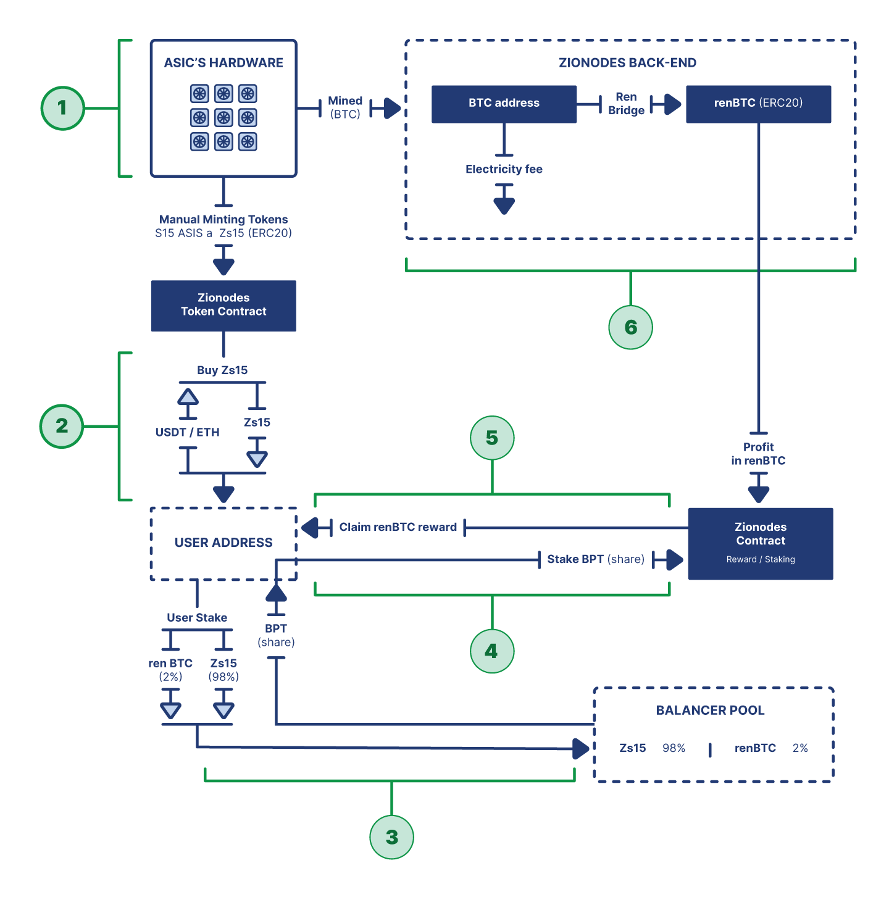

# Zionodes Token ETH

## Zionodes Tokenization Architecture
1. The user has the opportunity to buy an ASIC token, which is a representation of physical
equipment, and can then use it as a tool for mining, through the mining functionality by staked
tokens, available on our website, to generate income.

2. Users purchase a token of ASIC directly through the project portal, using "buy" functionality -
available by using the following cryptocurrencies: USDT and ETH. When purchasing ASIC tokens
through the site, the contract receives information from the back-end and sends to the client's
address the appropriate (integer) number of tokens in ERC20 format. Price corresponding token
spelled out in the contract in USDT equivalent. Also, you can buy an ASIC token via Balancer pool
paired with renBTC.

3. Received ASICs tokens are sent to the staking pool, where they are distributed in pairs with
renBTC in the proportion of 98%/2% - this step is taken so that users who want to have it but do
not have the opportunity to buy an integer number of tokens, can buy a fractional part through the
pool. When stacking, the customer receives a BPT token to his wallet address.

4. Received BPT tokens are stacked on a mining contract to receive a mining reward.

5. Mining reward is formed due to the real mining process of physical ASIC and is converted to
renBTC. The contract automatically distributes the reward among the participants in proportion to
their share in the seeking.

6. The contract using ren bridge technology converts BTC to renBTC and reflects the balance of
available rewards, less maintenance, and electricity costs

